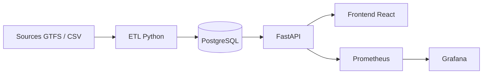

# ObRail Europe

Plateforme de collecte, transformation, exposition et visualisation de donnees ferroviaires europeennes.

ObRail Europe assemble :

- un ETL Python pour consolider les donnees GTFS / CSV
- une base PostgreSQL pour le stockage transactionnel et analytique
- une API FastAPI pour exposer les trajets, les statistiques et l'etat de la plateforme
- un frontend React cartographique pour la consultation metier
- une pile d'observabilite avec Prometheus et Grafana

Ce depot est prevu pour etre lance en local avec Docker Compose, tout en restant exploitable service par service pour le developpement.

## Sommaire

- [Vue d'ensemble](#vue-densemble)
- [Fonctionnalites](#fonctionnalites)
- [Architecture](#architecture)
- [Technologies](#technologies)
- [Structure du depot](#structure-du-depot)
- [Prerequis](#prerequis)
- [Configuration](#configuration)
- [Demarrage rapide](#demarrage-rapide)
- [Utilisation quotidienne](#utilisation-quotidienne)
- [Services et ports](#services-et-ports)
- [API disponible](#api-disponible)
- [ETL et donnees](#etl-et-donnees)
- [Frontend](#frontend)
- [Monitoring et observabilite](#monitoring-et-observabilite)
- [Tests](#tests)
- [CI/CD](#cicd)
- [Documentation complementaire](#documentation-complementaire)
- [Depannage](#depannage)
- [Commandes utiles](#commandes-utiles)

## Vue d'ensemble

ObRail Europe permet de charger des jeux de donnees ferroviaires europeens, de les transformer en un modele commun, puis de les exploiter via :

- une API HTTP documentee
- un dashboard cartographique
- des indicateurs de supervision technique et metier

Le flux principal est le suivant :

1. l'ETL extrait des donnees brutes GTFS / CSV
2. les jeux sont nettoyes, enrichis et harmonises
3. les tables PostgreSQL transactionnelles et analytiques sont alimentees
4. FastAPI expose les trajets, volumes, metriques et informations de sante
5. le frontend React consomme l'API pour afficher les trajets et la carte
6. Prometheus et Grafana assurent la supervision

## Fonctionnalites

### Donnees

- ingestion de plusieurs sources ferroviaires europeennes
- normalisation des pays, operateurs, gares et trajets
- consolidation des trajets jour / nuit
- production d'artefacts de qualite et de metriques

### API

- `GET /health`
- `GET /trajets`
- `GET /trajets/{trip_id}`
- `GET /stats/volumes`
- `GET /api/dashboard/kpis`
- `GET /api/monitoring/summary`
- `GET /metrics`
- documentation Swagger sur `/api/docs`

### Frontend

- filtres de recherche par pays, operateur, type de service, annee, volume
- carte des corridors europeens
- selection d'un trajet et details associes
- tableau detaille des trajets
- indicateurs de synthese

### Observabilite

- disponibilite de l'API
- latence HTTP
- taux d'erreur HTTP
- metriques metier exposees en Prometheus
- logs applicatifs disponibles via Docker et fichier local
- dashboard Grafana provisionne automatiquement

## Architecture



## Technologies

### Backend

- Python 3.11
- FastAPI
- SQLAlchemy
- Pydantic
- Uvicorn

### Base de donnees

- PostgreSQL 15

### Frontend

- React 18
- Vite
- Leaflet
- React Leaflet

### Observabilite

- Prometheus
- Grafana

### Industrialisation

- Docker
- Docker Compose
- GitHub Actions
- Pytest

## Structure du depot

```text
.
|-- api/                         # API FastAPI
|-- database/                    # schema SQL et initialisation PostgreSQL
|-- etl/                         # pipeline batch d'extraction / transformation / chargement
|-- frontend/                    # dashboard React actif
|-- monitoring/                  # Prometheus / Grafana
|-- data/                        # jeux bruts, fichiers transformes, logs
|-- docs/                        # documentation technique et d'exploitation
|-- .github/workflows/ci.yml     # pipeline GitHub Actions
|-- docker-compose.yml
|-- .env.example
`-- README.md
```

## Prerequis

### Mode recommande

- Docker Desktop ou Docker Engine
- Docker Compose v2

### Ports a avoir disponibles

- `5432` : PostgreSQL
- `8000` : API FastAPI
- `8501` : frontend React
- `9090` : Prometheus
- `3000` : Grafana

### Pour le developpement local hors Docker

- Python 3.11+
- Node.js 20+
- npm
- une instance PostgreSQL accessible

## Configuration

Copier le fichier d'exemple :

### Bash

```bash
cp .env.example .env
```

### PowerShell

```powershell
Copy-Item .env.example .env
```

Variables principales :

| Variable | Description | Exemple |
|---|---|---|
| `DB_USER` | utilisateur PostgreSQL | `postgres` |
| `DB_PASSWORD` | mot de passe PostgreSQL | `change_me` |
| `DB_NAME` | nom de la base | `obrail` |
| `DATABASE_URL` | URL SQLAlchemy | `postgresql://postgres:change_me@db:5432/obrail` |
| `APP_ENV` | environnement applicatif | `development` |
| `APP_VERSION` | version exposee par l'API | `2.1.0` |
| `LOG_LEVEL` | niveau de log | `INFO` |
| `ENABLE_PROMETHEUS` | active `/metrics` | `true` |
| `APP_LOG_PATH` | chemin du log applicatif | `/app/data/logs/api.log` |
| `CORS_ORIGINS` | origines autorisees | `http://localhost:8501,...,http://127.0.0.1:4173` |
| `PROMETHEUS_URL` | URL publique Prometheus | `http://localhost:9090` |
| `GRAFANA_URL` | URL publique Grafana | `http://localhost:3000` |
| `GRAFANA_ADMIN_USER` | login Grafana | `admin` |
| `GRAFANA_ADMIN_PASSWORD` | mot de passe Grafana | `admin` |
| `TRANSITLAND_ENABLED` | active la prospection Transitland | `false` |

## Demarrage rapide

### 1. Construire et lancer la stack

```bash
docker compose up -d --build
```

### 2. Charger les donnees

```bash
docker compose run --rm etl
```

### 3. Ouvrir les interfaces

- API : `http://localhost:8000`
- Swagger : `http://localhost:8000/api/docs`
- Frontend : `http://localhost:8501`
- Prometheus : `http://localhost:9090`
- Grafana : `http://localhost:3000`

### 4. Verifier l'etat du systeme

```bash
docker compose ps
```

Puis :

```bash
curl http://localhost:8000/health
```

## Utilisation quotidienne

### Relancer uniquement l'ETL

```bash
docker compose run --rm etl
```

### Recharger la base a zero avant ETL

```bash
docker compose run --rm -e RESET_DB=true etl
```

### Redemarrer uniquement le frontend

```bash
docker compose up -d --build dashboard
```

### Redemarrer uniquement l'API

```bash
docker compose up -d --build api
```

## Services et ports

| Service | Role | Port hote | Remarques |
|---|---|---:|---|
| `db` | PostgreSQL | `5432` | base transactionnelle et analytique |
| `etl` | pipeline batch | - | execution a la demande |
| `api` | FastAPI | `8000` | API principale |
| `dashboard` | React + Nginx | `8501` | interface utilisateur active |
| `prometheus` | metriques | `9090` | scrapes API et metriques metier |
| `grafana` | dashboards | `3000` | visualisation |

## API disponible

### Endpoints principaux

| Methode | Route | Description |
|---|---|---|
| `GET` | `/health` | sante globale de l'API, de la base et des artefacts |
| `GET` | `/trajets` | liste des trajets avec filtres et tri |
| `GET` | `/trajets/{trip_id}` | detail d'un trajet |
| `GET` | `/stats/volumes` | volumes par pays et annee |
| `GET` | `/metrics` | metriques Prometheus |
| `GET` | `/api/docs` | documentation Swagger |

### Endpoints utiles au frontend

| Methode | Route | Description |
|---|---|---|
| `GET` | `/api/countries` | liste des pays |
| `GET` | `/api/operators` | liste des operateurs |
| `GET` | `/api/dashboard/kpis` | indicateurs de synthese |
| `GET` | `/api/monitoring/summary` | resume technique et metier |
| `GET` | `/api/analysis/train-types-comparison` | comparaison jour / nuit |
| `GET` | `/api/statistics/timeline` | serie temporelle |
| `GET` | `/api/statistics/co2-ranking` | classement CO2 |

### Filtres de `GET /trajets`

Parametres disponibles :

- `limit`
- `offset`
- `country_code`
- `operator_name`
- `year`
- `service_type`
- `search`
- `sort_by`
- `sort_order`

Exemple :

```bash
curl "http://localhost:8000/trajets?country_code=FR&service_type=Nuit&limit=20"
```

## ETL et donnees

### Comportement

L'ETL :

- lit les sources declarees
- extrait les donnees GTFS / CSV
- uniformise les champs
- enrichit les informations pays / operateurs / gares
- charge PostgreSQL
- produit des fichiers de suivi dans `data/processed`

### Dossiers de donnees

| Dossier | Contenu |
|---|---|
| `data/raw/` | donnees brutes telechargees ou archives |
| `data/processed/` | jeux transformes et rapports |
| `data/logs/` | logs applicatifs API |

### Fichiers utiles generes

- `data/processed/trips_cleaned_final.csv`
- `data/processed/quality_report.json`
- `data/processed/model_metrics.json`

## Frontend

Le frontend actif est le dossier `frontend/`.

Le service Docker `dashboard` pointe vers ce frontend React.

### Lancer le frontend seul en local

```bash
cd frontend
npm install
npm run dev
```

Le frontend sera alors disponible sur `http://localhost:5173`.

### Variables frontend

Le frontend peut consommer une base API custom via :

- `VITE_API_BASE_URL`

Par defaut, les appels sont resolus sur la meme origine que l'interface servie.
En developpement Vite pur sur `5173` ou `4173`, le frontend bascule automatiquement vers `http://127.0.0.1:8000` si `VITE_API_BASE_URL` n'est pas defini.

## Monitoring et observabilite

### Prometheus

Prometheus collecte :

- les metriques HTTP de FastAPI
- les metriques metier `obrail_*`
- la disponibilite de l'API via la metrique `up`

Metriques metier exposees :

- `obrail_database_connected`
- `obrail_total_trips`
- `obrail_total_countries`
- `obrail_total_operators`
- `obrail_total_night_trips`
- `obrail_total_day_trips`
- `obrail_latest_ingestion_timestamp_seconds`

### Grafana

Grafana est provisionne automatiquement avec :

- la datasource Prometheus
- le dashboard `ObRail Overview`

Important :

- si Grafana a deja ete initialise une premiere fois, le couple `GRAFANA_ADMIN_USER` / `GRAFANA_ADMIN_PASSWORD` de `.env` ne remplace pas forcement les identifiants deja stockes dans le volume persistant
- en cas de doute, verifier le volume Grafana ou repartir d'un environnement vierge

### Logs applicatifs

- l'API ecrit ses logs dans `data/logs/api.log`
- les journaux restent consultables via `docker compose logs`

### Endpoints utiles de supervision

- `http://localhost:9090/-/healthy`
- `http://localhost:9090/api/v1/targets`
- `http://localhost:8000/metrics`
- `http://localhost:8000/health`

## Tests

### Tests Python

Depuis la racine :

```bash
pytest
```

### Tests API dans Docker

```bash
docker compose run --rm api pytest -q
```

### Tests frontend

```bash
cd frontend
npm test
npm run build
npm run e2e
```

### Tests E2E sur stack Docker

```bash
docker compose up -d db api dashboard
psql -h localhost -U postgres -d obrail -f database/seed_e2e.sql
cd frontend
npm run e2e:stack
```

### Tests E2E visuels

```bash
cd frontend
npm run e2e:headed
```

## CI/CD

Le workflow GitHub Actions est disponible dans :

- `.github/workflows/ci.yml`

Le pipeline :

1. prepare Python et Node.js
2. demarre PostgreSQL
3. initialise le schema SQL
4. execute les tests backend
5. execute les tests frontend unitaires
6. build le frontend React pour l'API reelle
7. seed la base pour les scenarios Playwright
8. demarre l'API reelle pour les E2E
9. execute les tests E2E Playwright
10. verifie `docker compose config`
11. construit les images Docker et publie des artefacts testables

## Documentation complementaire

- [Architecture](docs/architecture.md)
- [Deploiement](docs/deploiement.md)
- [Tests](docs/tests.md)
- [CI/CD](docs/cicd.md)
- [Monitoring](docs/monitoring.md)
- [Conformite MSPR](docs/conformite_mspr_tpre532.md)
- [RGPD, accessibilite, securite](docs/rgpd_accessibilite_securite.md)
- [Maintenance et rollback](docs/maintenance_rollback.md)
- [Plan de soutenance](docs/soutenance_plan.md)
- [Trame de rapport](docs/rapport_mspr_tpre532.md)

## Depannage

### Le dashboard est vide

Verifier :

1. que l'ETL a bien ete execute
2. que l'API repond sur `http://localhost:8000/health`
3. que le navigateur a bien recharge le nouveau bundle (`Ctrl+F5`)

### Grafana refuse les identifiants de `.env`

Si Grafana a deja ete initialise, le mot de passe peut provenir du volume persistant existant.  
Le plus simple est soit :

- de reutiliser les identifiants deja definis
- soit de repartir d'un environnement propre si cela est acceptable

### Prometheus n'affiche pas les targets

Verifier :

- `docker compose ps`
- `http://localhost:9090/api/v1/targets`
- la sante de l'API sur `/health`

### Les logs applicatifs sont insuffisants

Verifier :

- la presence de `data/logs/api.log`
- `docker compose logs api`

### Aucun trajet n'apparait apres le demarrage

La pile applicative seule ne charge pas automatiquement les donnees metier.  
Il faut lancer :

```bash
docker compose run --rm etl
```

### Des ports sont deja occupes

Adapter les ports de `docker-compose.yml` ou liberer les ports locaux concernes.

## Commandes utiles

### Etat des services

```bash
docker compose ps
```

### Logs en temps reel

```bash
docker compose logs -f api
docker compose logs -f dashboard
docker compose logs -f etl
docker compose logs -f prometheus
docker compose logs -f grafana
```

### Rebuild cible

```bash
docker compose up -d --build api
docker compose up -d --build dashboard
docker compose build etl
```

### Verification compose

```bash
docker compose config
```

### Arret de la stack

```bash
docker compose down
```

### Arret avec suppression des volumes

Attention : cette commande supprime les volumes Docker associes a la stack.

```bash
docker compose down -v
```

## Notes d'exploitation

- l'ETL reste volontairement decouple de l'API pour garder un mode batch simple et robuste
- le frontend actif est `frontend/`, servi via le service `dashboard`
- les artefacts produits dans `data/processed` et `data/logs` font partie du fonctionnement normal du projet
- les donnees historiques disponibles dependent des archives source effectivement exploitables

## Licence et usage

Ce depot est utilise dans un contexte de projet pedagogique / MSPR.  
Verifier les licences des sources de donnees externes avant tout usage hors cadre de demonstration ou d'evaluation.
