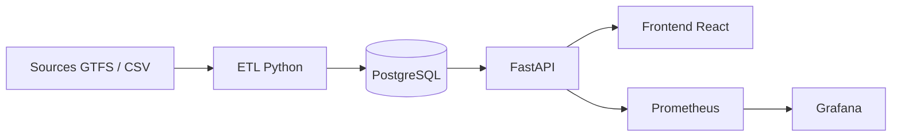

# Architecture

## Vue d'ensemble

La solution cible se compose d'un pipeline ETL batch, d'une base PostgreSQL, d'une API FastAPI, d'un frontend React cartographique et d'une pile d'observabilite Prometheus/Grafana.

## Choix techniques

- `FastAPI` : expose rapidement une API documentee avec validation Pydantic et Swagger.
- `PostgreSQL` : convient au stockage relationnel et analytique du projet.
- `React + Leaflet` : apporte une interface plus professionnelle, une carte interactive et une meilleure lisibilite pour la soutenance.
- `Prometheus + Grafana` : couvre la supervision de disponibilite, latence, erreurs et indicateurs metier.
- `Docker Compose` : simplifie l'orchestration locale et la soutenance.

## Flux applicatif

1. L'ETL telecharge et transforme les donnees ferroviaires.
2. Les donnees consolidees sont chargees dans PostgreSQL.
3. FastAPI interroge la couche transactionnelle et analytique.
4. Le frontend React consomme les endpoints `/trajets`, `/stats/volumes`, `/health`.
5. Prometheus scrape `/metrics`, y compris les metriques derivees de `/health`.
6. L'API ecrit aussi ses logs dans `data/logs/api.log` et sur la sortie standard Docker.
7. Grafana visualise les indicateurs de supervision et les metriques metier.

## Architecture cible du backend

- `api/main.py` : application FastAPI, middleware, Prometheus, lifecycle
- `api/database.py` : acces SQL centralise
- `api/routers/` : routes metier et monitoring
- `api/schemas/` : contrats Pydantic
- `api/tests/` : tests unitaires et integration

## Points d'attention

- l'ETL reste volontairement decouple du runtime API
- les endpoints historiques sont conserves pour compatibilite
- les tests d'integration injectent des donnees de test isolees sans casser l'existant
