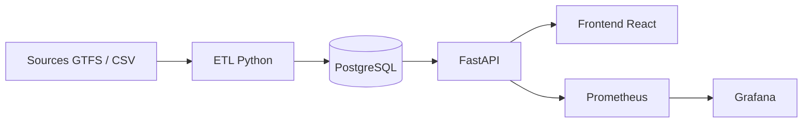

# Rapport MSPR TPRE532 - Trame de redaction

> Document de travail a utiliser comme base de rapport MSPR EPSI TPRE532.
> Ce fichier peut etre complete et adapte en fonction de l'etat final du depot,
> des captures et des resultats obtenus au moment du rendu.

---

## 1. Informations generales

- Titre du projet : ObRail Europe
- Bloc : MSPR EPSI TPRE532 - Produire et maintenir une solution IA
- Type de solution : plateforme de collecte, traitement, exposition et supervision de donnees ferroviaires europeennes
- Depot Git : `A renseigner apres push`
- Auteur(s) : `A renseigner`
- Date : `A renseigner`

---

## 2. Resume executif

ObRail Europe est une solution de data engineering et de restitution analytique autour des trajets ferroviaires europeens. Le projet repose sur un ETL Python qui collecte et transforme des donnees GTFS et CSV, une base PostgreSQL qui stocke les couches transactionnelle et analytique, une API FastAPI qui expose les trajets et les statistiques, un frontend React cartographique pour la consultation metier, et une couche d'observabilite avec Prometheus et Grafana.

L'objectif de cette MSPR etait de transformer un prototype technique en solution plus industrialisee, testee, documentee, conteneurisee et exploitable en environnement de soutenance ou de pre-production. Les travaux ont porte sur la fiabilisation de l'ETL, la normalisation des endpoints API, l'ajout de tests automatises, la mise en place d'une CI GitHub Actions, la supervision applicative et la redaction d'une documentation d'exploitation.

---

## 3. Contexte et problematique

Le prototype initial comportait deja plusieurs briques utiles :

- une API FastAPI
- une base PostgreSQL
- un pipeline ETL Python
- un frontend React cartographique
- un `docker-compose.yml`

Cependant, le projet n'etait pas encore au niveau attendu pour une MSPR orientee industrialisation :

- les endpoints n'etaient pas alignes sur un contrat simple et stable
- le `healthcheck` etait minimal
- l'observabilite etait absente
- il n'y avait pas de vraie strategie de tests
- la CI/CD n'etait pas en place
- la documentation restait insuffisante pour une soutenance Bloc 3

En parallele, l'ETL presentait plusieurs limites techniques sur la volumetrie et la qualite des donnees :

- certaines sources GTFS historiques etaient mal exploitees
- les pays pouvaient remonter en `ZZ` ou `Unknown`
- les circulations GTFS n'etaient pas assez detaillees par date de service

---

## 4. Objectifs de la MSPR

Les objectifs retenus pour la MSPR TPRE532 etaient les suivants :

1. stabiliser le backend FastAPI
2. proposer des endpoints clairs pour les trajets, les volumes et la sante de l'application
3. renforcer la validation, la gestion d'erreurs et les logs
4. conserver un frontend simple mais plus professionnel
5. rendre le projet lancable integralement avec Docker Compose
6. ajouter une base de tests unitaires et d'integration
7. mettre en place une CI GitHub Actions
8. ajouter une supervision Prometheus / Grafana
9. documenter l'architecture, les tests, le deploiement, la maintenance, la securite et l'accessibilite

---

## 5. Diagnostic initial du projet

### 5.1 Points deja presents

- pipeline ETL separe du backend
- stockage relationnel PostgreSQL
- API FastAPI deja fonctionnelle sur plusieurs routes metier
- frontend cartographique capable de consommer l'API
- conteneurisation partielle via Dockerfiles et Docker Compose

### 5.2 Faiblesses constatees

#### API

- absence d'un contrat centre sur `trajets`
- `GET /health` trop pauvre
- pas de resume monitoring
- pas de middleware de journalisation unifie
- pas de gestion d'erreurs applicative centralisee

#### Frontend

- interface exploitable mais encore tres "prototype"
- pas de vue de supervision
- navigation et ergonomie perfectibles

#### Docker / exploitation

- stack incomplete pour une soutenance orientee production
- pas de monitoring integre
- variables d'environnement peu formalisees

#### Tests

- pas de repertoire `tests/`
- pas de `pytest.ini`
- pas de couverture backend / frontend

#### CI/CD

- aucun workflow GitHub Actions

#### Documentation

- README insuffisant pour l'exploitation et la soutenance
- absence de runbooks et de documentation d'architecture

---

## 6. Architecture cible

### 6.1 Schema global



### 6.2 Raison des choix techniques

- **Python** : coherent avec l'existant ETL et API
- **FastAPI** : excellent compromis entre rapidite de developpement, validation et documentation OpenAPI
- **PostgreSQL** : robuste pour une couche transactionnelle et analytique simple
- **React + Leaflet** : choix plus presentable pour une soutenance, avec carte interactive, filtres riches et meilleure projection produit
- **Prometheus + Grafana** : standard pragmatique pour superviser les metriques techniques et metier sans surcharger la stack
- **Docker Compose** : suffisant pour un environnement local ou de demo

---

## 7. Arborescence cible

```text
.
|-- api/
|   |-- main.py
|   |-- database.py
|   |-- config.py
|   |-- errors.py
|   |-- logging_config.py
|   |-- routers/
|   |-- schemas/
|   `-- tests/
|-- frontend/
|   |-- src/
|   `-- tests/
|-- database/
|-- etl/
|-- monitoring/
|   |-- prometheus/
|   |-- grafana/
|-- docs/
|-- .github/workflows/ci.yml
|-- docker-compose.yml
|-- pytest.ini
`-- README.md
```

---

## 8. Travaux realises

## 8.1 ETL et qualite des donnees

Le travail ETL a ete poursuivi pour corriger plusieurs problemes metier qui degradaient la qualite du projet :

- conservation correcte du `country` detecte dans les donnees
- suppression des ecrasements par `ZZ` ou `Unknown` quand un pays etait deja identifiable
- enrichissement de l'inference des pays a partir des villes, des operateurs et des sources
- augmentation de la volumetrie via l'explosion GTFS par dates de service
- prise en charge d'archives locales par source
- passage en chargement cumulatif au lieu d'un reset systematique

Impact :

- volumetrie transformee beaucoup plus importante
- meilleure couverture geographique
- disparition des pays inconnus dans le jeu de donnees transforme

## 8.2 Backend FastAPI

### Endpoints ajoutes ou normalises

- `GET /health`
- `GET /trajets`
- `GET /trajets/{trip_id}`
- `GET /stats/volumes`
- `GET /api/monitoring/summary`

### Ameliorations backend

- centralisation du cycle de vie de l'application
- middleware de logs HTTP avec `request_id`
- en-tetes HTTP de securite de base
- gestion d'erreurs applicatives et de validation
- schemas Pydantic plus explicites
- documentation OpenAPI via Swagger
- instrumentation Prometheus si la dependance est disponible

### Fichiers backend importants

- `api/main.py`
- `api/database.py`
- `api/errors.py`
- `api/config.py`
- `api/routers/journeys.py`
- `api/routers/health.py`
- `api/routers/monitoring.py`
- `api/routers/statistics.py`

## 8.3 Frontend React

Le choix a ete fait d'introduire un frontend React avec Leaflet pour rendre la consultation plus visuelle, plus moderne et plus convaincante devant le jury.

### Evolutions

- interface plus propre visuellement
- separation des helpers frontend
- vues distinctes :
  - vue d'ensemble
  - catalogue des trajets
  - statistiques
  - monitoring
- detail d'un trajet via `/trajets/{id}`
- liens rapides vers Swagger, Prometheus, Grafana et `health`

### Valeur ajoutee

- meilleure lisibilite pour un jury
- demonstration plus fluide
- acces a la supervision sans changer d'outil

## 8.4 Docker et orchestration

Le `docker-compose.yml` a ete industrialise pour exposer une vraie stack complete :

- `db`
- `etl`
- `api`
- `dashboard`
- `prometheus`
- `grafana`

Des `healthchecks` ont ete ajoutes pour les services critiques.

Le projet est maintenant pense pour etre lance par :

```bash
docker compose up -d --build
```

## 8.5 Tests

Une base de tests automatises a ete ajoutee :

- tests unitaires frontend sur les helpers React
- tests E2E navigateur Playwright sur le dashboard React
- tests API sur `health`, `trajets`, `stats/volumes`, `monitoring`
- tests d'integration avec PostgreSQL reel et jeu de donnees de test injecte

Fichiers principaux :

- `pytest.ini`
- `api/tests/conftest.py`
- `api/tests/test_health.py`
- `api/tests/test_trajets.py`
- `api/tests/test_stats.py`
- `frontend/tests/utils.test.js`
- `frontend/tests/e2e/dashboard.spec.js`

## 8.6 CI/CD

Un pipeline GitHub Actions a ete ajoute dans :

- `.github/workflows/ci.yml`

Etapes principales :

1. checkout
2. installation Python
3. lancement de PostgreSQL
4. installation des dependances
5. installation du navigateur Chromium pour Playwright
6. initialisation du schema SQL
7. execution de `pytest`
8. build du frontend React pour l'API reelle
9. seed de la base pour les scenarios Playwright
10. demarrage de l'API reelle
11. execution des tests frontend unitaires puis E2E
12. validation de `docker compose config`
13. build des images Docker et publication d'artefacts

## 8.7 Monitoring et observabilite

La supervision repose sur :

- **Prometheus** pour la collecte des metriques techniques et metier
- **Grafana** pour la visualisation

Indicateurs suivis :

- disponibilite de l'API
- disponibilite de `/health` via `obrail_api_healthy`
- latence API
- taux d'erreurs HTTP
- debit de requetes
- volumetrie metier exposee en metriques Prometheus
- fraicheur de la derniere ingestion
- consultation des logs applicatifs via Docker et fichier local

---

## 9. Resultats obtenus

### Resultats techniques

- API plus stable et mieux structuree
- endpoints principaux conformes au besoin MSPR
- dashboard plus exploitable et plus demonstrable
- tests initialises
- CI/CD en place
- supervision disponible
- documentation structuree

### Resultats data

- augmentation forte de la volumetrie transformee
- meilleure couverture multi-pays
- suppression des pays inconnus dans le flux transforme local

### Resultats d'exploitation

- stack unique plus simple a lancer
- meilleure lisibilite de l'etat du systeme
- meilleure preparation a la soutenance

---

## 10. Securite, RGPD et accessibilite

## 10.1 RGPD

Le projet manipule essentiellement des donnees ferroviaires et non des donnees personnelles nominatives. Aucune information voyageur sensible n'est exposee dans l'API ou le dashboard.

Mesures retenues :

- pas de donnees personnelles exposees
- secrets externalises dans `.env`
- documentation des precautions d'exploitation

## 10.2 Securite

Mesures en place :

- validation des entrees via FastAPI et Pydantic
- requetes SQL parametrees
- CORS configurable
- logs applicatifs
- en-tetes HTTP de securite simples

Ameliorations futures possibles :

- reverse proxy HTTPS
- authentification API
- gestion des roles
- rotation des secrets

## 10.3 Accessibilite

Le dashboard a ete travaille dans une logique de sobriete et de lisibilite :

- filtres explicites
- navigation simple
- contrastes plus lisibles
- pages bien separees

Une vraie recette RGAA/WCAG complete resterait a faire dans une phase plus avancee.

---

## 11. Exploitation, maintenance et rollback

## 11.1 Exploitation

Commandes utiles :

```bash
docker compose up -d --build
docker compose run --rm etl
docker compose logs -f api
docker compose logs -f dashboard
docker compose logs -f etl
```

## 11.2 Maintenance

- verification du `health`
- verification de Grafana et Prometheus
- relance ETL si mise a jour data
- suivi des logs conteneurs

## 11.3 Rollback

Strategie simple :

1. revenir a une image ou un commit stable
2. relancer la stack
3. restaurer la base si necessaire

---

## 12. Limites actuelles

Malgre les ameliorations, certaines limites subsistent :

- les vraies archives 2015 -> aujourd'hui dependent encore de la disponibilite des sources historiques
- l'authentification n'est pas encore implementee

---

## 13. Perspectives d'evolution

- ajouter une authentification simple
- ajouter un reverse proxy Nginx ou Traefik
- brancher un stockage d'archives GTFS plus riche
- ajouter un lint / format check dans la CI
- completer l'alerting Grafana

---

## 14. Liste des preuves a ajouter dans le rapport final

Apres push du projet et execution locale, il sera utile d'ajouter :

- capture de `docker compose ps`
- capture de Swagger
- capture du frontend React avec carte
- capture de Grafana
- capture de Prometheus
- sortie de `pytest`
- capture du workflow GitHub Actions vert
- exemple d'appel `GET /health`
- exemple d'appel `GET /trajets`
- exemple d'appel `GET /stats/volumes`

---

## 15. Conclusion

Cette MSPR a permis de faire evoluer ObRail Europe d'un prototype fonctionnel vers un socle bien plus industrialise. Le projet dispose maintenant d'une architecture plus claire, d'une API mieux cadre, d'une base de tests, d'un pipeline CI, d'une supervision technique et d'une documentation d'exploitation.

Le choix d'une solution pragmatique basee sur FastAPI, PostgreSQL, React, Docker Compose, Prometheus et Grafana permet de presenter une plateforme coherente, demonstrable et defendable devant un jury EPSI, tout en conservant des axes d'amelioration realistes pour une phase ulterieure.

---

## 16. Notes personnelles a completer avant rendu

- URL du repo GitHub :
- noms des membres :
- captures d'ecran ajoutees :
- resultat final de `pytest` :
- resultat final de `docker compose up -d --build` :
- points forts a mettre en avant a l'oral :
- limites a reconnaitre proprement devant le jury :
